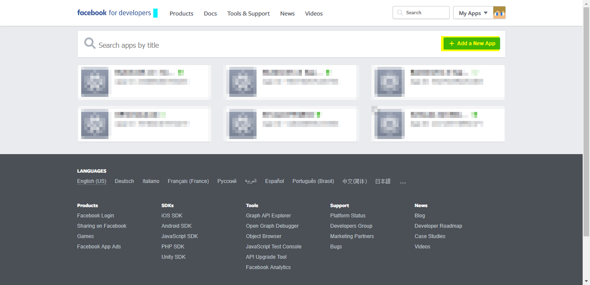
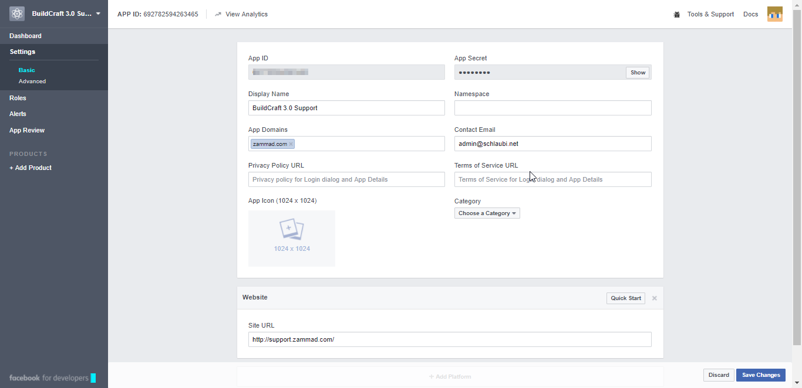
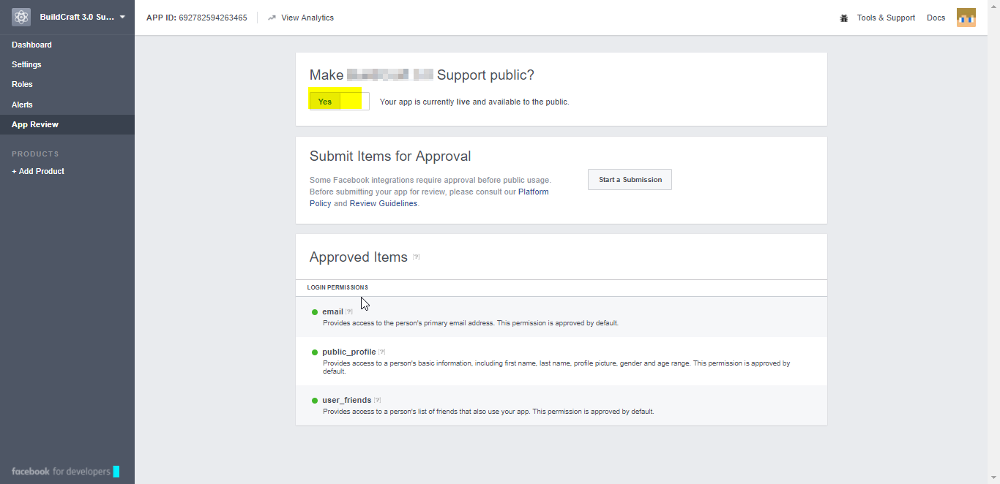
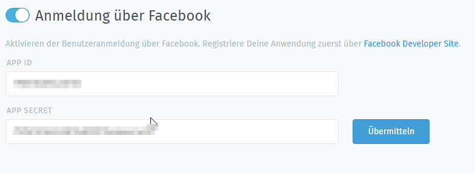
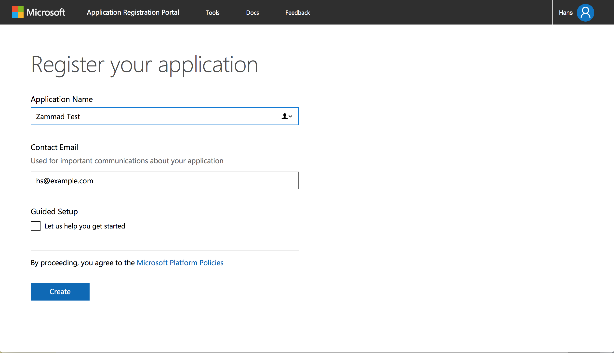
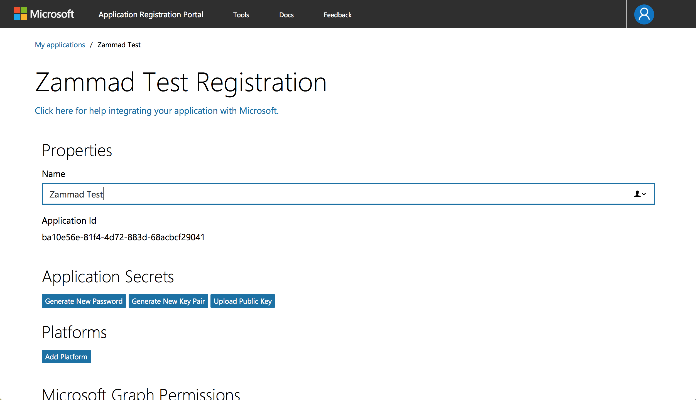
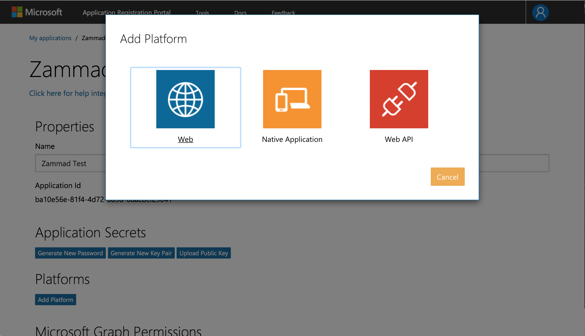
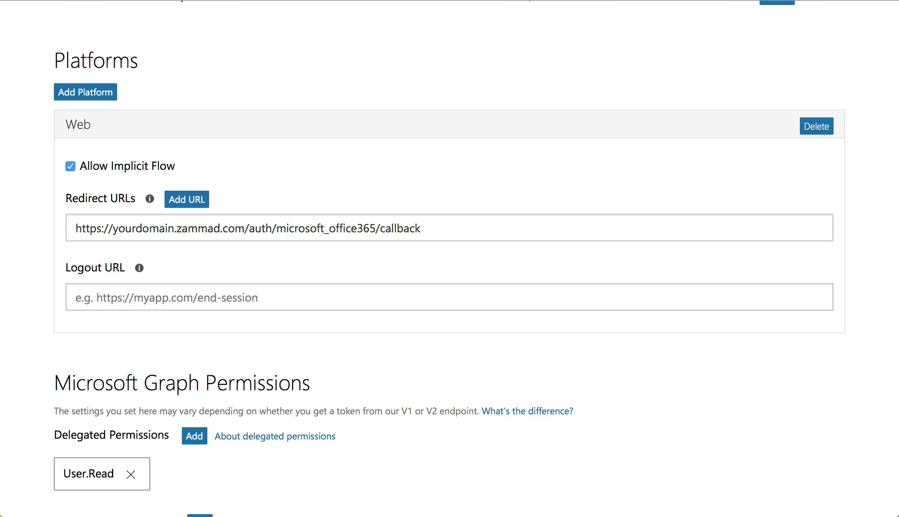
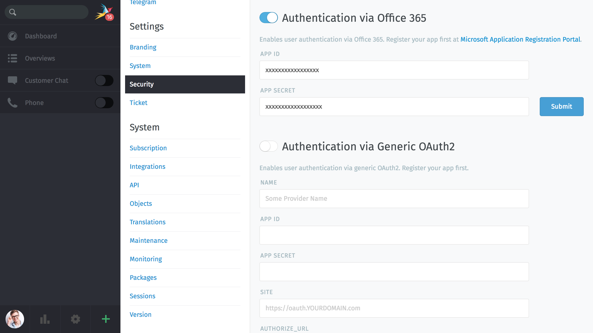
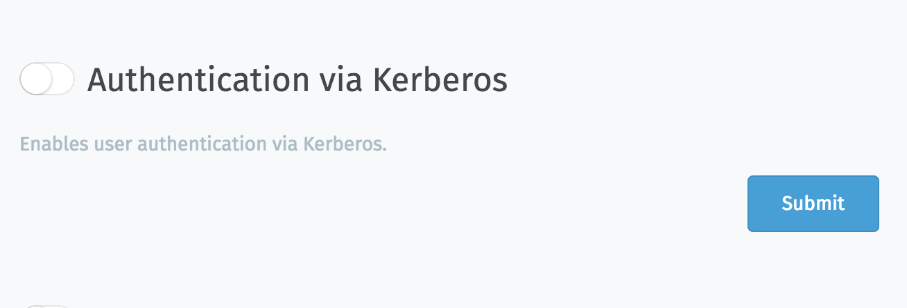

Security - Third-party applications (Login providers)
*****************************************************

Facebook
========

It is possible to create a quick login for your helpdesk via Facebook To do so, you need to follow these steps:

Register Facebook app
---------------------

Visit [https://developers.facebook.com/apps/] and click on "Add a new App"

:alt: initial page

After that enter the app settings

.. image:: images/developers.facebook.com-create-app.png
:alt: Create App

Navigate to "Settings" and fill in this infromation

:alt: App Settings

Navigate to app review and Check "Make [appname] public?"

:alt: App Review

Configure Zammad as Facebook app
--------------------------------

Navigate to "Admin -> Security -> Third Party Applications" and enter the App ID and the App Secret. You can find this Key in the Dashbard of your Facebok app

:alt: Zammad Configuration

Now you can link accounts via "Avatar -> Profil -> Link Accounts" or login via Zammad login page.

GitHub
======

It is possible to create a quick login for your helpdesk via GitHub.
To activate the quick login you need to enable OAuth for GitHub.

Register GitHub app
-------------------

Visit https://www.github.com/settings/applications/new and enter the app settings.
As callback URL enter "https://zammad_host/auth/github/callback"
where zammad_host has to be replaced with your Zammad FQDN

.. image:: images/zammad_connect_github_thirdparty_github.png
:alt: Register OAuth app on www.github.com

Configure Zammad as GitHub app
-------------------------------

Enter the "APP ID" and the "APP SECRET" from the GitHub OAUTH Applications Dashboard

.. image:: images/zammad_connect_github_thirdparty_zammad.png
:alt: GitHub config in Zammad admin interface

After you configured the GitHub credentials and activated
the login method, you should see a new icon on the login page.

.. image:: images/zammad_connect_github_thirdparty_login.png
:alt: GitHub logo on login page

If you click on the icon you will be redirected to GitHub and see something
similar to this:

.. image:: images/zammad_connect_github_thirdparty_github_authorize.png
:alt: GitHub oauth page

When you grant the access you will be redirected to your Zammad instance
and logged in as a customer.

Now you can link accounts via "Avatar -> Profil -> Link Accounts" or login via Zammad login page.

Gitlab
======

It is possible to create a quick login for your helpdesk via Gitlab.
To activate the quick login you need to enable OAuth for Gitlab.

Register Gitlab app
-------------------

To register an app in Gitlab open your profile and select applications.

As callback URL enter "https://zammad_host/auth/gitlab/callback"
where zammad_host has to be replaced with your Zammad FQDN

.. image:: images/zammad_connect_gitlab_thirdparty_gitlab.png
:alt: Register OAuth app on gitlab instance

At the moment we need the "api" scope. This is caused due a bug
in Gitlab: https://gitlab.com/gitlab-org/gitlab-ce/issues/33022

Configure Zammad as Gitlab app
------------------------------

Enter the "APP ID" and the "APP SECRET" from the Gitlab OAUTH Applications Dashboard.
.. image:: images/zammad_connect_gitlab_thirdparty_zammad.png
:alt: Gitlab config in Zammad admin interface

After you configured the Gitlab credentials and activated
the login method, you should see a new icon on the login page.

.. image:: images/zammad_connect_gitlab_thirdparty_login.png
:alt: Gitlab logo on login page

If you click on the icon you will be redirected to Gitlab and see something
similar to this:

.. image:: images/zammad_connect_gitlab_thirdparty_gitlab_authorize.png
:alt: Gitlab oauth page

When you grant the access you will be redirected to your Zammad instance
and logged in as a customer.

Now you can link accounts via "Avatar -> Profil -> Link Accounts" or login via Zammad login page.

Google
======

Register Google app
-------------------

Visit https://console.cloud.google.com/projectcreate and create an project

Go to https://console.developers.google.com. Select Credentials from the menu and then Create Credentials

Create an OAUTH Client ID

In Zammad, 2.0.x, the configuration should look like:

Authorized JavaScript origins
https://zammad_host/

Authorized redirect URIs
https://zammad_host/auth/google_oauth2/callback

zammad_host has to be replaced with your Zammad FQDN

.. image:: images/cloud.developers.google.com-create-oauth-id.png
:alt: Google

Navigate to "Admin -> Security -> Third Party Applications" -> Google and enter the OAUTH Keys (Client ID & Client's Secret)

.. image:: images/zammad_connect_google_thirdparty1.png
:alt: Zammad

Now you can link accounts via "Avatar -> Profil -> Link Accounts" or login via Zammad login page.

Twitter
=======

It is possible to create a quick login for your helpdesk via Twitter To do so, you need to follow these steps:

Register Twitter app
--------------------

Go to https://dev.twitter.com/apps and login with your account.

.. image:: images/apps.twitter.com_start.png
:alt: inital page

Click on "Create App"

.. image:: images/apps.twitter.com_new_app_screen.png
:alt: new app page

Enter app settings. As "Callback URL" you need to enter "https://zammad_host/api/v1/external_credentials/twitter/callback"

After the app has been created, update the application icon and organization attributes.

.. image:: images/apps.twitter.com_set_permissions.png
:alt: set permissions to receive and send direct messages

Next we need to set _read, write and access direct messages permissions_ for the app.

.. image:: images/apps.twitter.com_get_credentials.png
:alt: click on Keys & Access Token, note them

Go to "Keys and Access Token" tab and note the "Consumer Key" and "Consumer Secret".

Configure Zammad as Twitter app
-------------------------------

Go to "Admin -> Security -> Twitter -> Third Party Applications -> Twitter Section"

.. image:: images/zammad_connect_twitter_thirdparty1.png
:alt: Admin -> Security -> Third Party Applications

Fill in the "Twitter Key" and the "Twitter Secret" and click the "Submit" button.

Now you can link accounts via "Avatar -> Profil -> Link Accounts" or login via Zammad login page.

Microsoft (also Office 365)
=======

It is possible to create a quick login for your helpdesk via Microsoft (also Office 365) To do so, you need to follow these steps:

Register Microsoft app
--------------------

Go to https://identity.microsoft.com (or https://apps.dev.microsoft.com) and login with your account.

:alt: inital page

Click on "Create App"

:alt: new app page

Enter app settings. Then a new plattform and select "web".

:alt: new plattform

:alt: set callack/redirect url

As "Redirect URL" you need to enter "https://yourdomain.zammad.com/auth/microsoft_office365/callback"

After the app has been created, update the application icon and organization attributes.

Click on "Generate New Password" button and note the "Password" and "Application Id".

Configure Zammad as Microsoft app
-------------------------------

Go to "Admin -> Security -> Twitter -> Third Party Applications -> Office 365 Section"

:alt: Admin -> Security -> Third Party Applications

Fill in the "APP ID" and the "APP SECRET" and click the "Submit" button.

Now you can link accounts via "Avatar -> Profil -> Link Accounts" or login via Zammad login page.

Kerberos
========

You can now use a compatible Kerberos version 5 implementation (we suggest using MIT Kerberos)

Configure your Zammad server to communicate with KDC 
----------------------------------------------------

You should have configured your server where Zammad is installed with at least similar configuration in /etc/krb5.conf like the below example:

::

  [logging]
      default = FILE:/var/log/krb5.log

  [libdefaults]
      default_realm = ZAMMAD.COM
      kdc_timesync = 1
      ccache_type = 4
      forwardable = true
      proxiable = true

  [realms]
      ZAMMAD.COM = {
          kdc = kdc.zammad.com
          admin_server = kerberos-admin.zammad.com
          default_domain = zammad.com
      }

  [domain_realm]
      .zammad.com = ZAMMAD.COM
      zammad.com = ZAMMAD.COM

Configure Zammad to accept Kerberos authentication
--------------------------------------------------

Go to "Admin -> Security -> Third Party Applications

Click on "Authentication via Kerberos" slider and click "Submit" button.

:alt: Enable Kerberos 

LinkedIn
========

This section is coming soon
