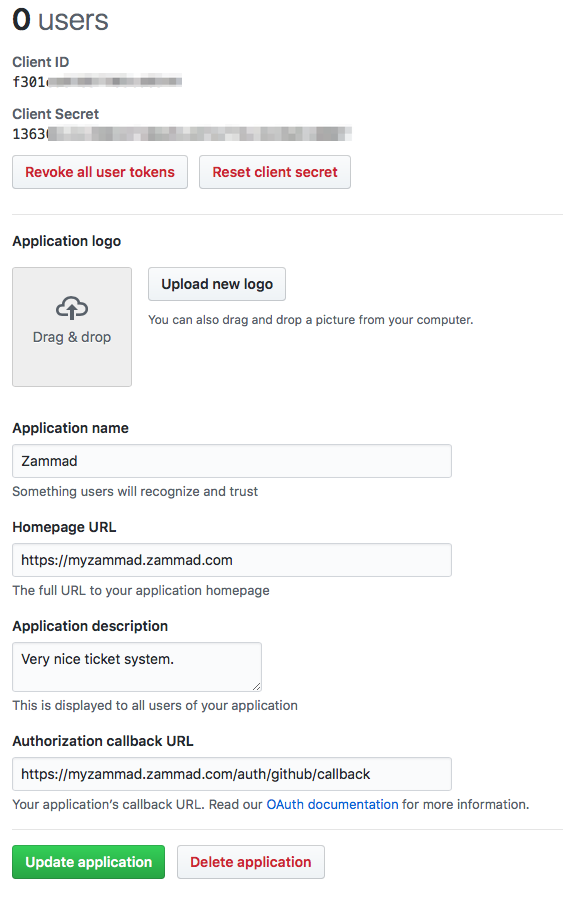
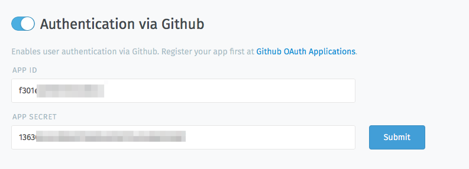
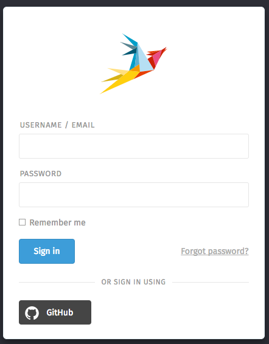
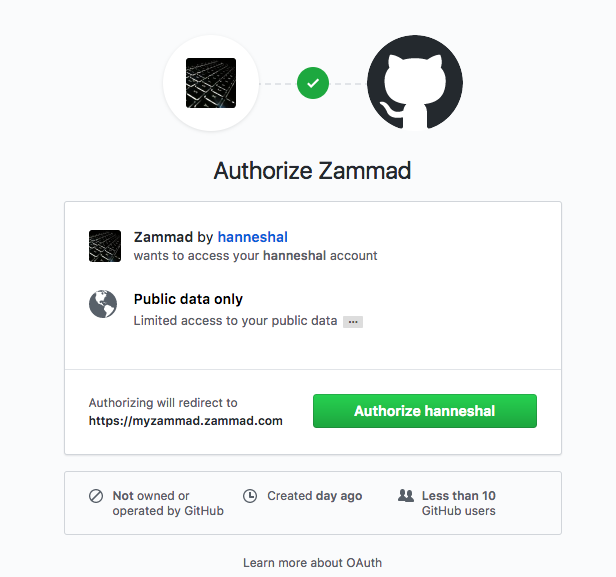

Social Logins - GitHub
**********************

It is possible to create a quick login for your helpdesk via GitHub.
To activate the quick login you need to enable OAuth for GitHub.

Register GitHub App
===================

Visit https://www.github.com/settings/applications/new and enter the app settings.
As callback URL enter "https://zammad_host/auth/github/callback"
where zammad_host has to be replaced with your Zammad FQDN

Configure Zammad as GitHub app
==============================

Enter the "APP ID" and the "APP SECRET" from the GitHub OAUTH Applications Dashboard

After you configured the GitHub credentials and activated
the login method, you should see a new icon on the login page.

If you click on the icon you will be redirected to GitHub and see something
similar to this:

When you grant the access you will be redirected to your Zammad instance
and logged in as a customer.
