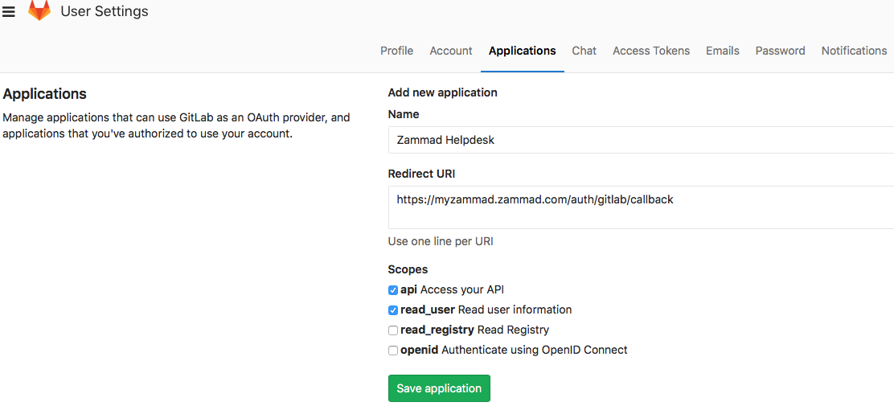
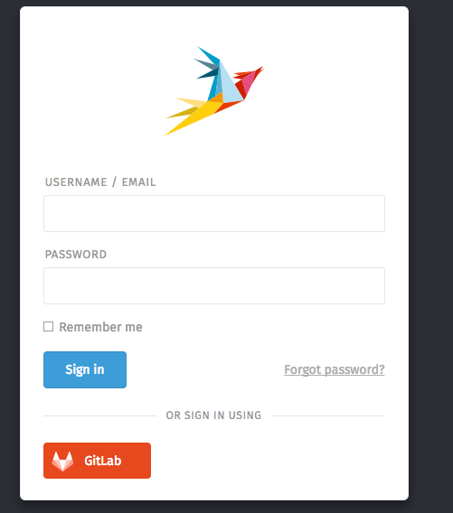
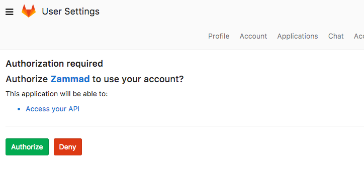

Gitlab
******

It is possible to create a quick login for your helpdesk via Gitlab.
To activate the quick login you need to enable OAuth for Gitlab.

Register Gitlab App
===================

To register an app in Gitlab open your profile and select applications. 

As callback URL enter "https://zammad_host/auth/gitlab/callback"
where zammad_host has to be replaced with your Zammad FQDN

At the moment we need the "api" scope. This is caused due a bug
in Gitlab: https://gitlab.com/gitlab-org/gitlab-ce/issues/33022
   
Configure Zammad as Gitlab app
==============================

Enter the "APP ID" and the "APP SECRET" from the Gitlab OAUTH Applications Dashboard.
.. image:: images/zammad_connect_gitlab_thirdparty_zammad.png
   :alt: Gitlab config in Zammad admin interface
   

After you configured the Gitlab credentials and activated
the login method, you should see a new icon on the login page.

If you click on the icon you will be redirected to Gitlab and see something 
similar to this:

When you grant the access you will be redirected to your Zammad instance
and logged in as a customer. 