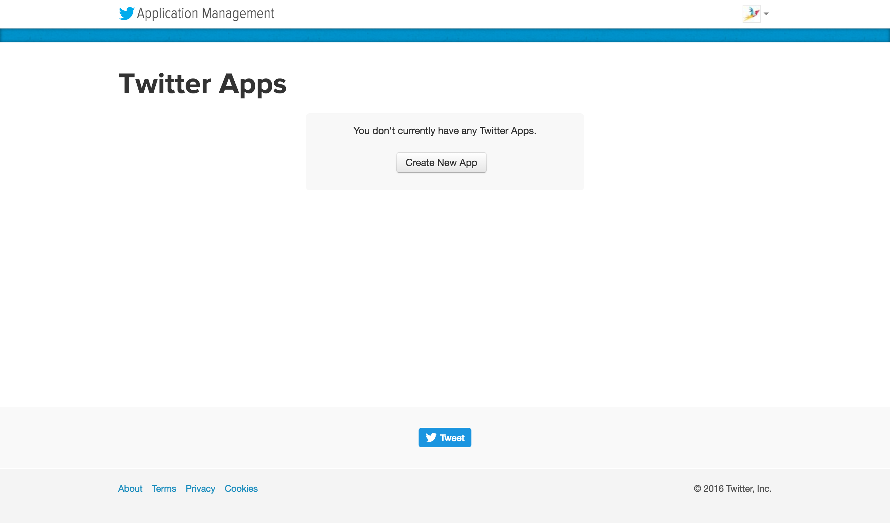
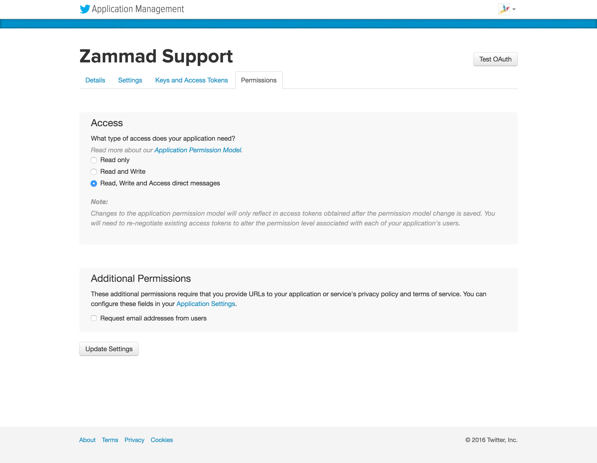
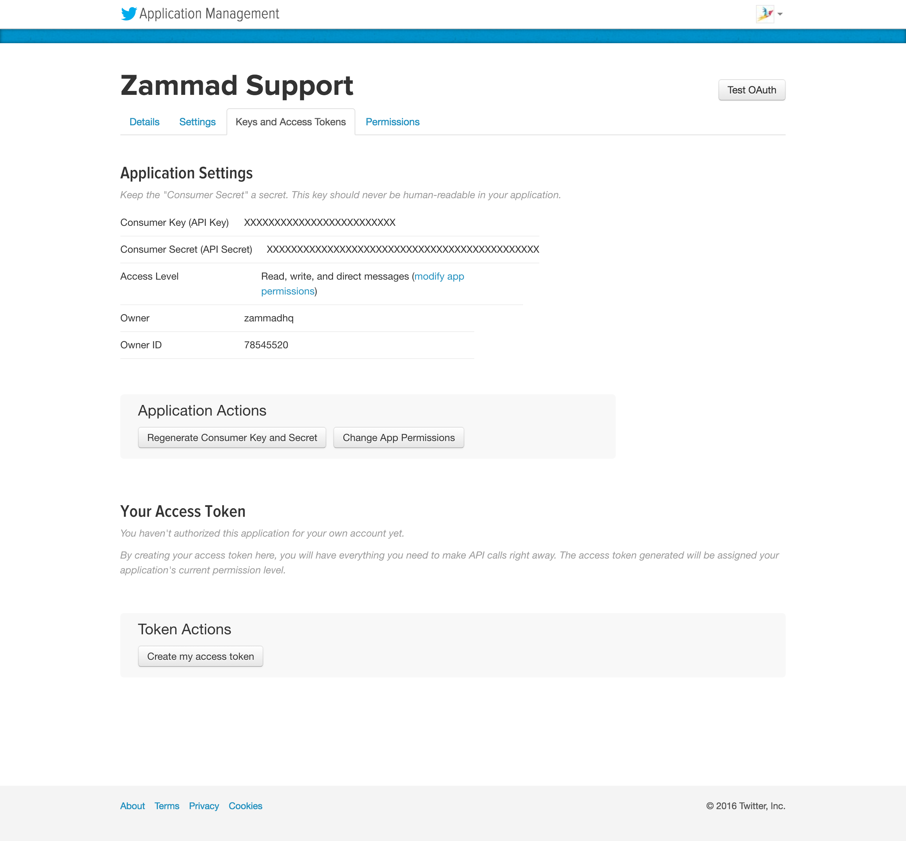
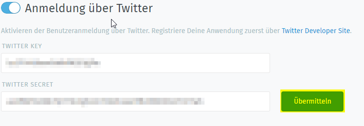

Twitter
*******

It is possible to create a quick login for your helpdesk via Twitter To do so, you need to follow these steps:

Register Twitter app
====================

   
   Click on "Create App"
   
   
   .. image:: images/apps.twitter.com_new_app_screen.png
   :alt: new app page
   
   Enter app settings. As "Callback URL" you need to enter "https://zammad_host/api/v1/external_credentials/twitter/callback"
   
   After the app has been created, update the application icon and organization attributes.

Next we need to set _read, write and access direct messages permissions_ for the app.

Go to "Keys and Access Token" tab and note the "Consumer Key" and "Consumer Secret".

Configure Zammad as Twitter app
===============================

Go to "Admin -> Security -> Twitter -> Third Party Applications -> Twitter Section"

   
Fill in the "Twitter Key" and the "Twitter Secret" and click the "Submit" button.
