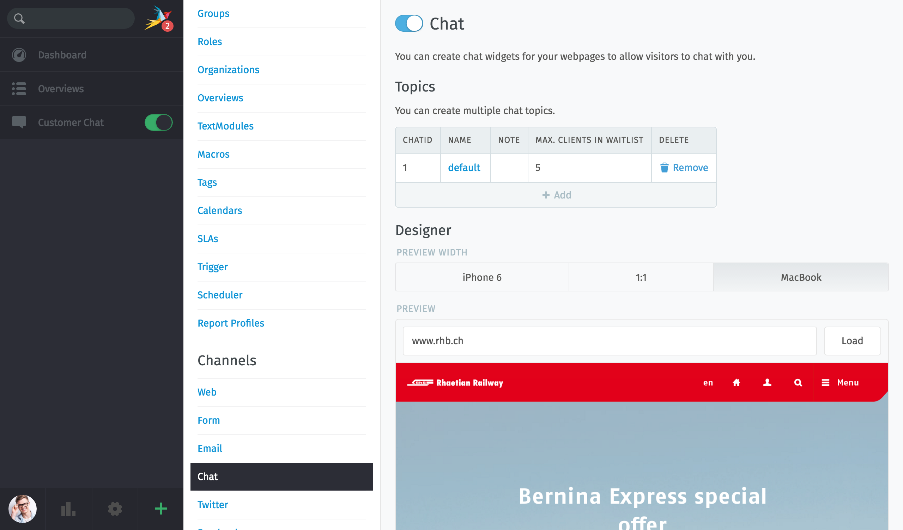
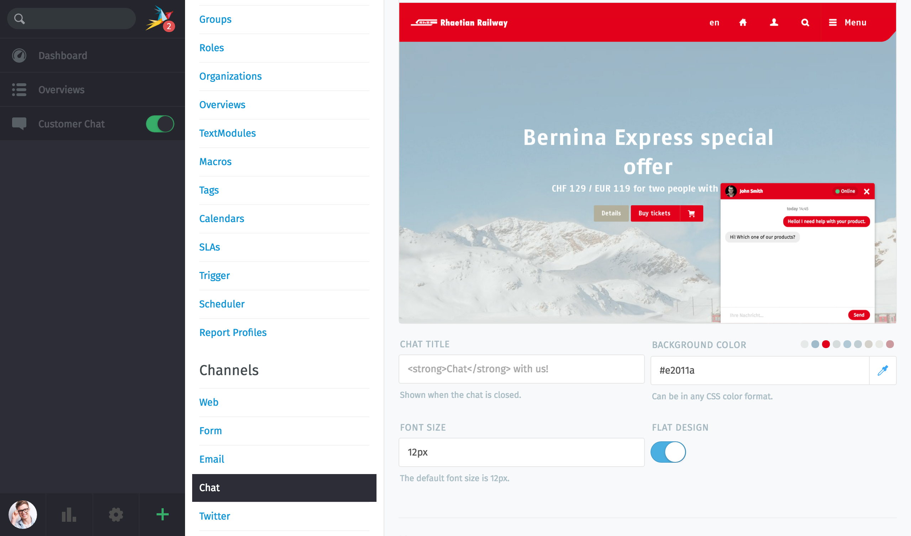
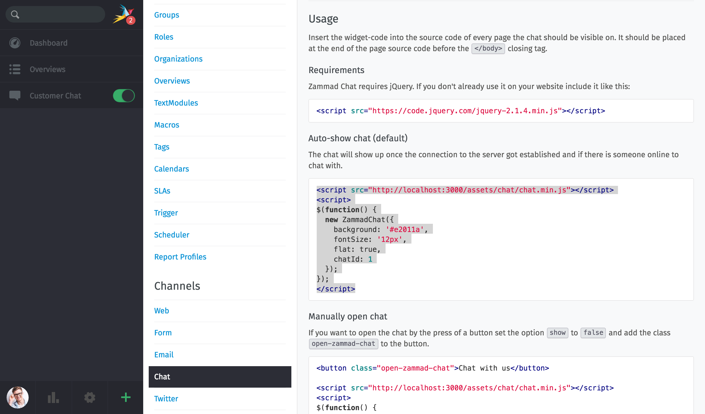
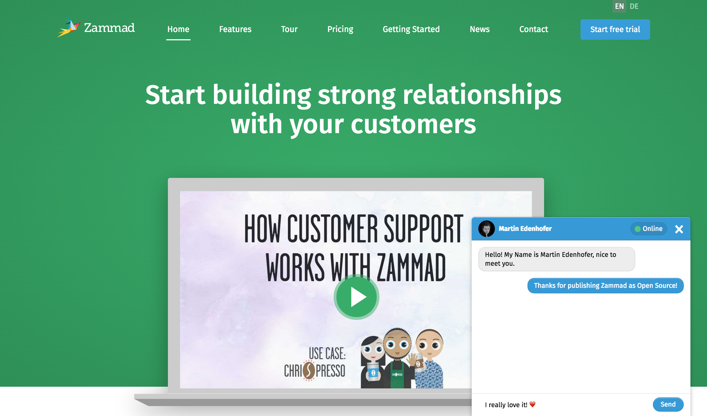

Chat
****

Chat for company or customer support would have been looked at as unprofessional just a few years ago. That has changed rapidly: today, the written conversation embodies personalized service and appreciation. If used properly, support via chat is a real efficiency booster. But chats also have a potential irritation factor if nobody responds or it’s just a robot holding the fort.
We have designed the Zammad chat support so that we can remove as many of the disadvantages described above as possible or at least cushion their blow.

Chat Support: A Blessing or a Curse?
====================================

We asked around a bit to learn what people in our field think about chat support. This is what we found out:

Good experiences

* I get personal contact with a human
* I get a quick answer or my problem is solved quickly

Bad experiences

* A chat window will appear on the website, but no one is online. Just a “Leave a message” form shows up
* Nobody responds when I send a message to the support team
* To my message I promptly get some message like "My name is Nina, what can I do for you?" but you never get any more information or I have to wait minutes for an answer.
* The chat sticks out like a sore thumb from the website design and it makes me wonder if it’s not just a trick.

Our answer: the Zammad chat widget
==================================

The task is clear: take the disadvantages and turn them into advantages. Just keep on thinking exactly where the others left off. Here's our approach to the topic of chat support:

Leave a message
===============

The Zammad chat widget on your page is only displayed if at least one support person is online and still has capacity for chat work. If none of the support staff has time, then there is no chat support either: simple as that. Alternatively, and independently, we offer Zammad forms that allow you to embed a contact or support form into the website.

Long waiting times
==================

A support staff is automatically set to "unavailable" if they either have not accepted a new chat request for two minutes or their Zammad app is offline. This way, a support staff’s coffee break doesn’t automatically turn into a communication gaffe. If all support staff take a break together, the chat widget is hidden, see previous point.

Auto responder
==============

We don’t send any automatic messages to start a chat conversation in order to avoid the strange delay after the initial message. Although for every support staff there are individual salutations available, they are triggered manually by the agent and not fired off automatically. This is exactly what chat is all about: truly being there for the customer.

Foreign Body Chat Module
========================

So that the Zammad chat widget fits with your website, we have come up with something: the Autodesign Mode. Just enter the URL of your website and Zammad recognizes and imports the color scheme of your website automatically.

Zammad displays a preview of the widget on the site - and your perfectly integrated chat form is done! Both chat and forms can be integrated via a JavaScript snippet into your own website using copy-paste.

So let's start: Go to "Admin -> Channels -> Chat" and enable the switch for this feature, a new navigation item "Customer Chat" will appear. Below you can adapt your form settings.

In the preview mode you can test if it fits your needs (e. g. change colors or design)

Just copy the JavaScript snippet and paste it into your website. That's all. All done within 5 minutes.

Finally, it will look like the following:

