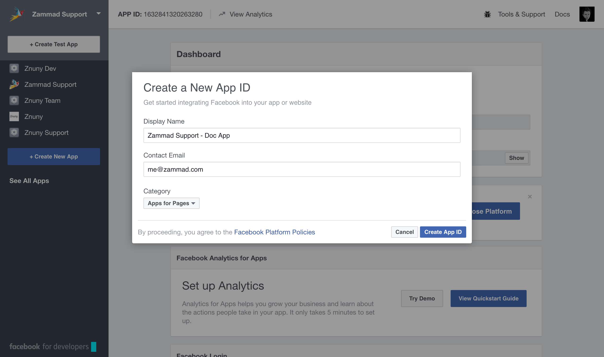
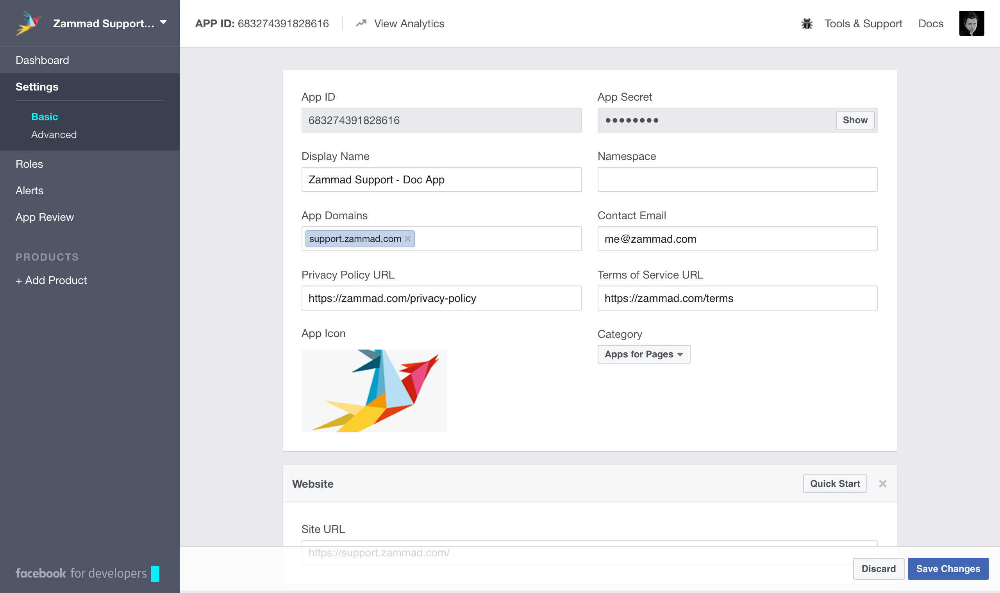
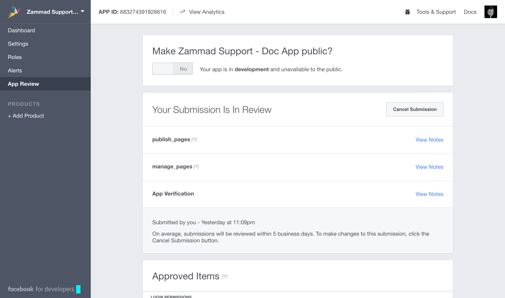
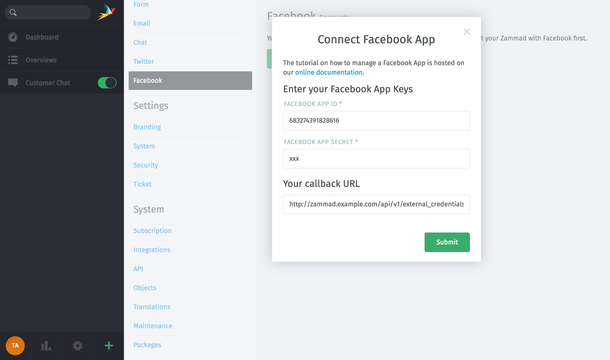
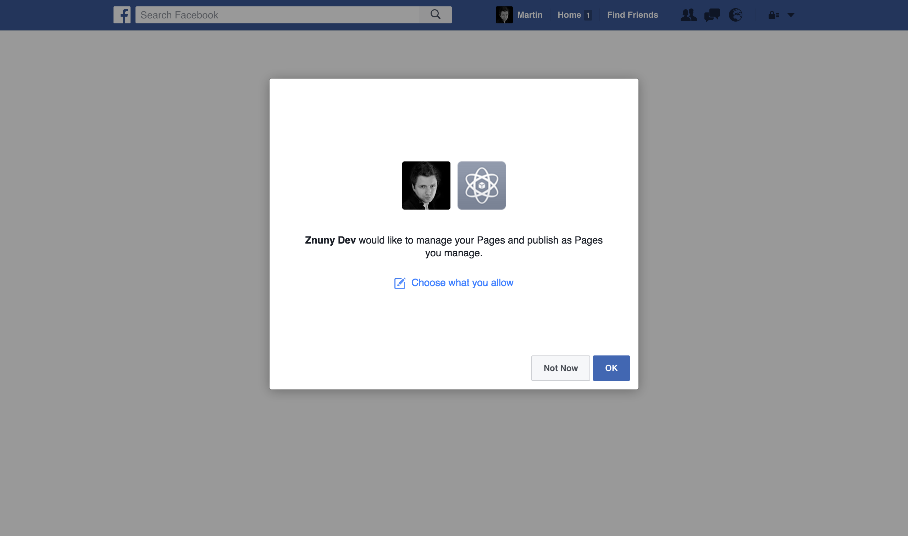
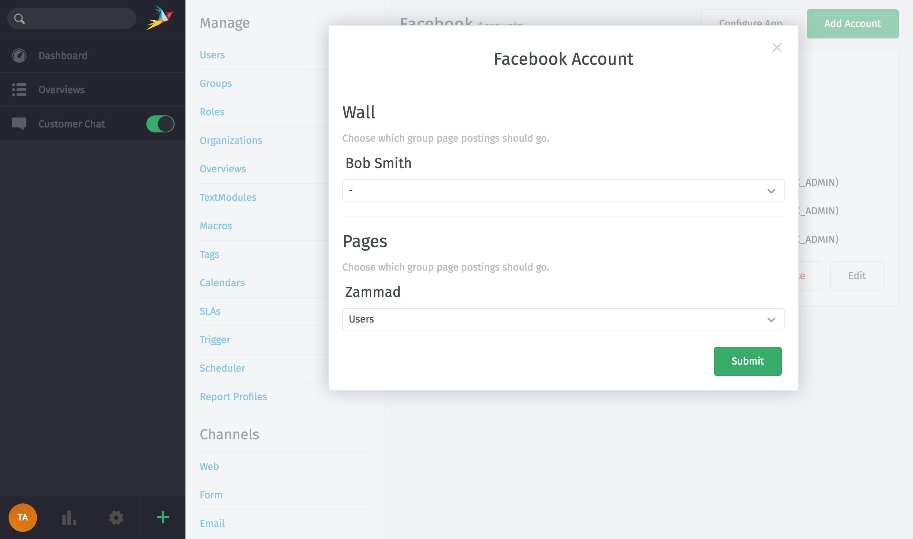
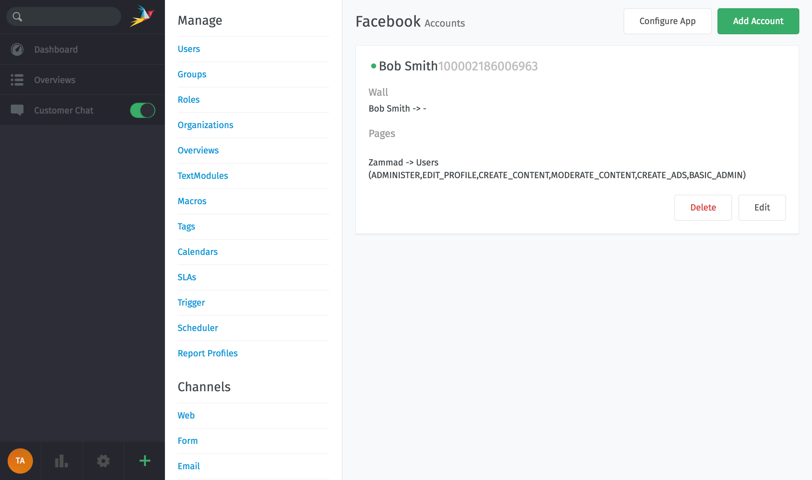

Facebook
********

It's possible to put your Facebook Page communication into Zammad. To do so, you need to follow these steps:

Register Facebook app
=====================

Register your Zammad as Facebook app under https://developers.facebook.com.

Click on "Create New App" and enter app name

You need to do the following:

* Go to Settings -> Basic
* "+ add Platform" -> Website and enter your Zammad URL link http://support.zammad.com
* Fill "App Domains", "Contact Email", "Privacy Policy URL", "Terms of Service URL" and add a app icon

Finally "Save Changes".

In order to read and write on facebook pages we need to get "publish_pages" and "manage_pages" permissions.

Go to "App Review" and request them.

Finally go to Settings -> Basic -> "App Secret" -> "Show" and note the "App ID" and "App Secret".

Configure Zammad as Facebook app
================================

Go to "Admin -> Channels -> Facebook"

.. image:: images/zammad_connect_app1.png
   :alt: Admin -> Channels -> Facebook

Click on "Connect Facebook App" and enter your "App ID", "APP Secret" and verify the "Callback URL".

Done, your Zammad is configured as Facebook App now.

Link your Facebook Page to your Zammad Facebook app
===================================================

Now you need to link your Facebook Page from which you want to get posts and send out comments.

Click on "Add Account", then you will see the authorize app page of Facebook. Click on "authorize app".

.. image:: images/zammad_link_facebook_account.png
   :alt: Click on "Add Account"

You will get redirected back to Zammad. Now you need to configure your search keys, where mentions and direct messages should get routed.

After you are done, you will get an overview of all linked Facebook Accounts.

Start using your new channel
============================

Start and write a post to your page, short time later you will have a new ticket in Zammad.

Just click on reply button (as you do it for emails) to send a comment.
