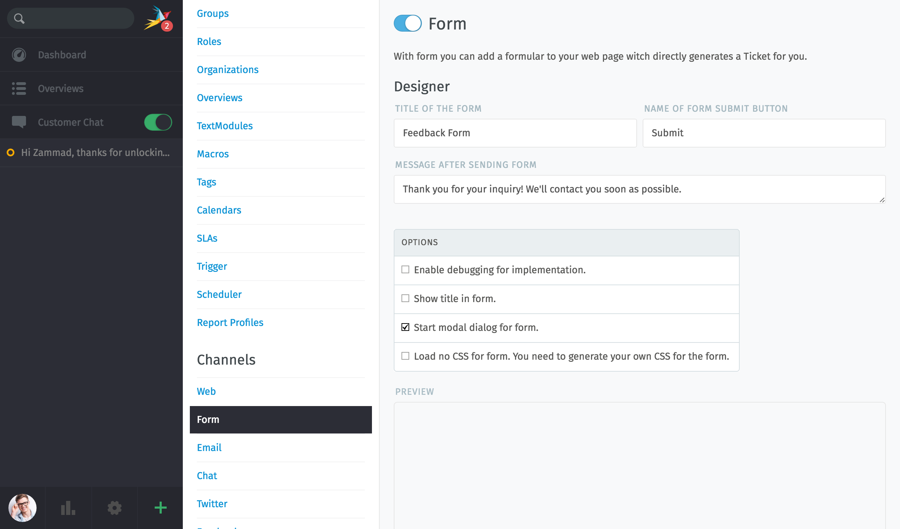
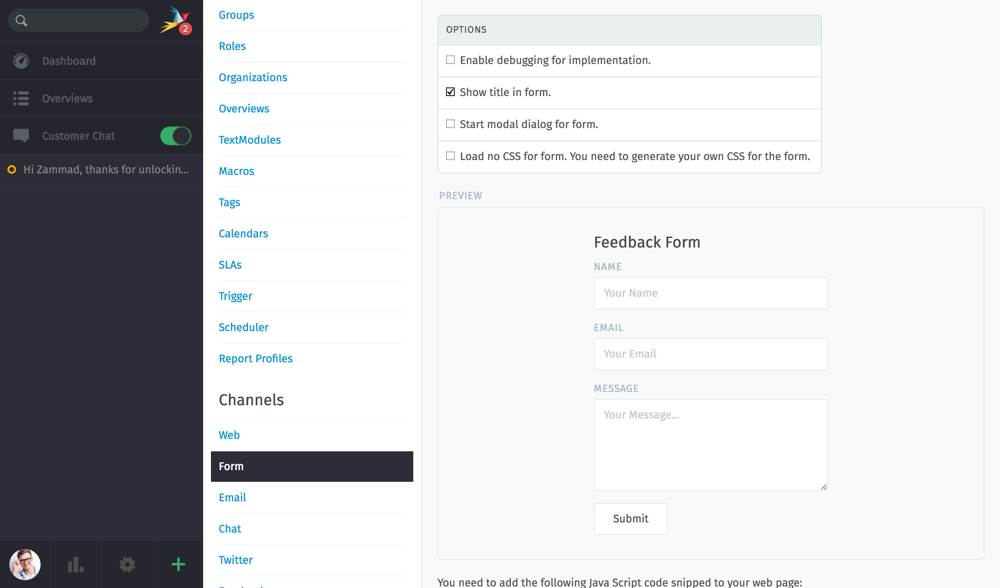
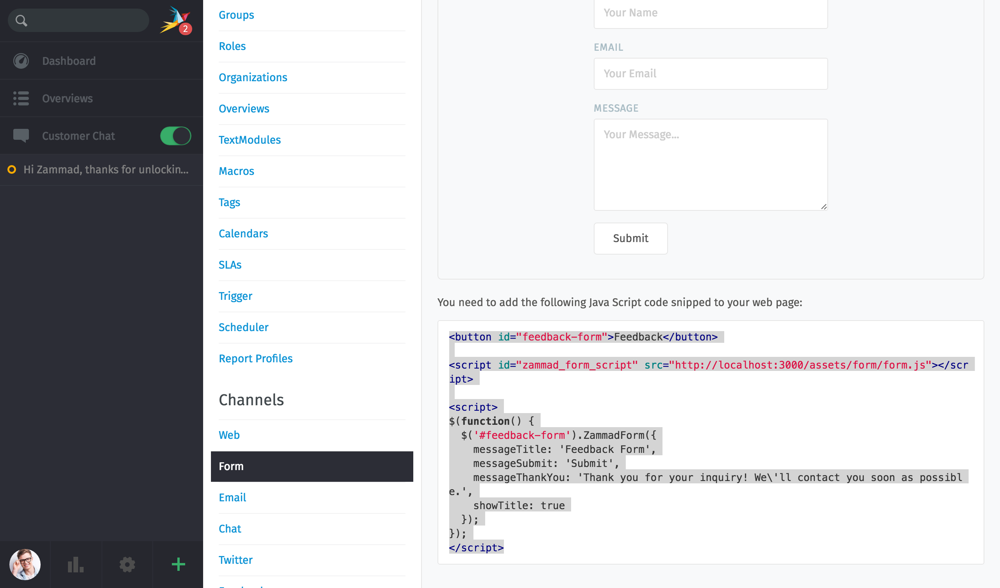
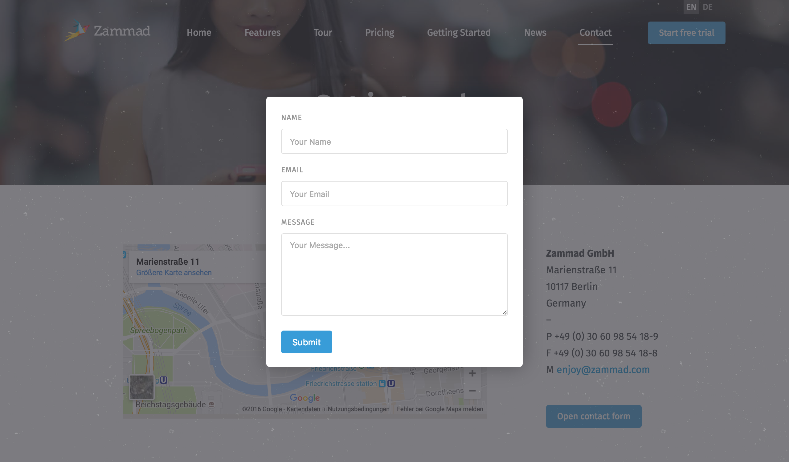

Web Form
********

Feedback or contact forms are quite often used on websites. Usually they will generate an email which will be sent to somebody who forwards it and so on. With Zammad it’s quite easy to integrate these forms into your website and directly generate tickets with them. In just 2 minutes.

Go to "Admin -> Channels -> Form" and enable the switch for this feature. Below you can adapt your form settings.

In preview mode you can test if the form fits your needs (e. g. if it opens as modal dialog or if it's shown inline on the website)

Just copy the JavaScript snippet and paste it into your website. That's all. Just 2 minutes.

Finally, the forms will look as follows:

