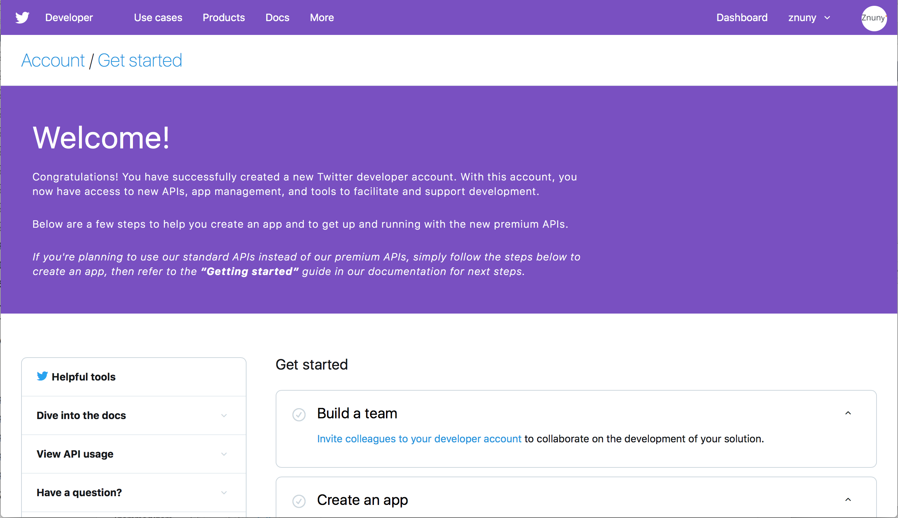
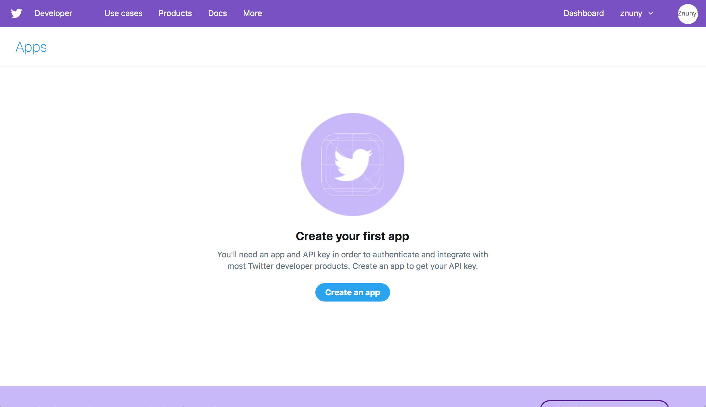
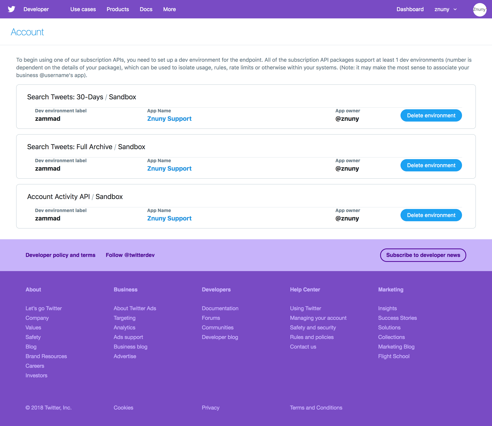

Twitter
=======

Zammad supports Twitter integration,
meaning you can send and receive tweets and DMs just like emails!

.. figure:: images/zammad_first_tweet_as_ticket.png
   :alt: Twitter Ticket with draft reply
   :align: center

   Twitter tickets will show a 🐦 Twitter bird in the reply area. Just click on the reply button (as you would for an email) to tweet back.

.. note::
   To set it up, follow the steps below:

   1. Apply for a `Twitter Developer account`_.
   2. `Create a new Twitter app`_ for Zammad.
   3. Set your new app’s permissions to *Read, write, and access direct messages.*
   4. Generate a new access token & secret.
   5. `Set up a dev environment`_ for the Account Activity API.
   6. Add your new Twitter app in Zammad.
   7. Add your Twitter account in Zammad.
   8. Configure filters for creating new tickets based on **#tags** and **@mentions**.

   Read on for details about each step.

1. Apply for a Twitter Developer account
----------------------------------------

   This welcome page is displayed after completing the application for a Developer account.

You will need a regular Twitter account with a verified phone number
to apply for a `Twitter Developer account`_ (at https://developer.twitter.com).

During the application process, you will be asked
to **Describe in your own words what you are building**.
You may use the answer below::

   1. To manage customer service communications for our organization.
   2. No.
   3. Our use case involves posting original tweets in response to tweets and DMs we receive. We will not use the Twitter API to post or like “content”.
   4. Our application will display individual tweets in their original form to authorized customer service agents of our organization only.

2. Create a new Twitter app for Zammad
--------------------------------------

   To create a new app, select **Apps** under your user menu, then click **Create an app**.

Once you have finished setting up your Developer account,
use it to `create a new Twitter app`_.
The following fields are **required:**

App name
   Must be unique *across all of Twitter.* No other developer account may create an app with the same name.

Application description
   Anything is fine here.
   
Website URL
   The URL of your Zammad instance.

Callback URLs
   ``https://<zammad_instance>/api/v1/external_credentials/twitter/callback``

   This URL is also visible in the **Connect Twitter App** dialog of your Zammad admin settings panel.

Tell us how this app will be used
   Anything is fine here. We suggest the following::

      This app will be used to manage Twitter communications between our customers and our organization’s customer service agents on Zammad.

3. Set your new app’s permissions
---------------------------------

   .. figure:: images/apps.twitter.com_set_permissions.png
      :alt: Twitter Developer account: App permissions page
      :align: center

      Select *Read, write, and access direct messages.*

4. Generate a new access token & secret
---------------------------------------

   .. figure:: images/apps.twitter.com_get_credentials.png
      :alt: Twitter Developer account: App keys and tokens page
      :align: center

      You will need all four keys/tokens later, so don’t close this tab.

5. Set up a dev environment
---------------------------

After creating your app, `set up a dev environment`_ for the Account Activity API.

   Name it whatever you like (*e.g.,* ``zammad``). You will need the label later, so don’t forget it.

6. Add your new Twitter app in Zammad
-------------------------------------

.. figure:: images/zammad_connect_twitter_app1.png
   :alt: Zammad: Configure Twitter app
   :align: center

   Add your new Twitter app under **Channels > Twitter** in the admin settings panel. You will need the keys, tokens, and dev environment label from Steps 4 and 5.

7. Add your Twitter account in Zammad
-------------------------------------

.. figure:: images/zammad_link_twitter_account.png
   :alt: Zammad: Add Twitter account
   :align: center

   Click **Add Account** under **Channels > Twitter** in the admin settings panel.

.. figure:: images/twitter.com_authorize_app.png
   :alt: Twitter: Authorize Zammad
   :align: center

   You will be redirected to Twitter and asked to authorize Zammad to access your account.

8. Configure filters
--------------------

.. figure:: images/zammad_linked_twitter_account.png
   :alt: Zammad: Configure Twitter accounts
   :align: center

   Set up filters to automatically create new tickets based on **#tags** or **@mentions**.

That’s it! Now, incoming tweets and DMs will be automatically turned into Zammad tickets.

.. _Twitter developer account: https://developer.twitter.com/en/apply/user
.. _create a new Twitter app: https://developer.twitter.com/en/apps/create
.. _set up a dev environment: https://developer.twitter.com/en/account/environments
