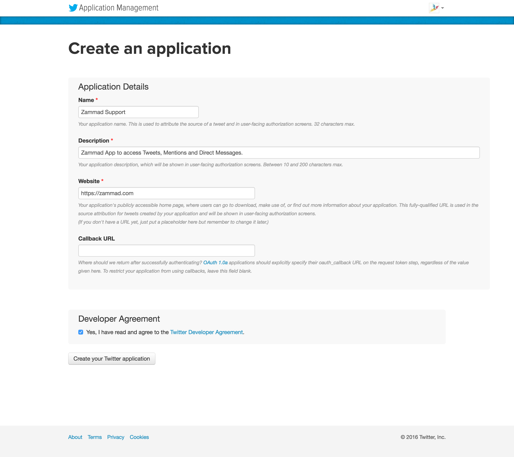
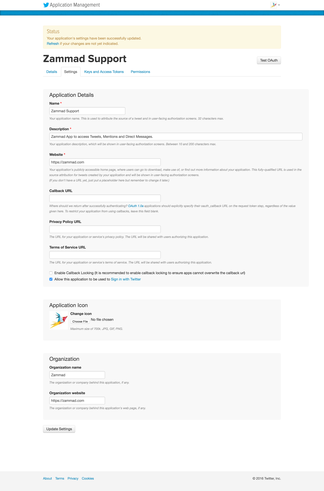
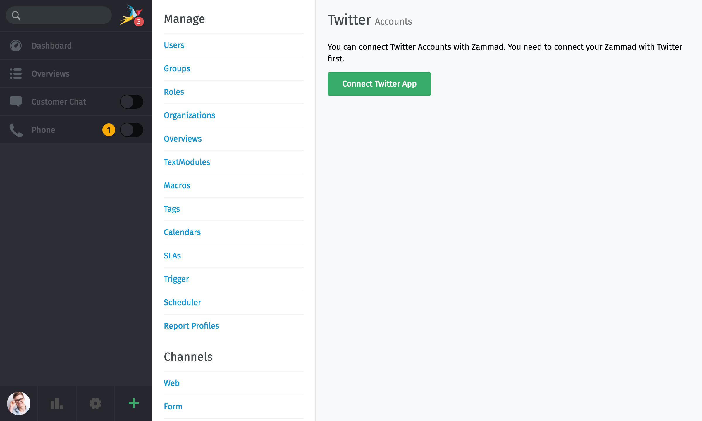
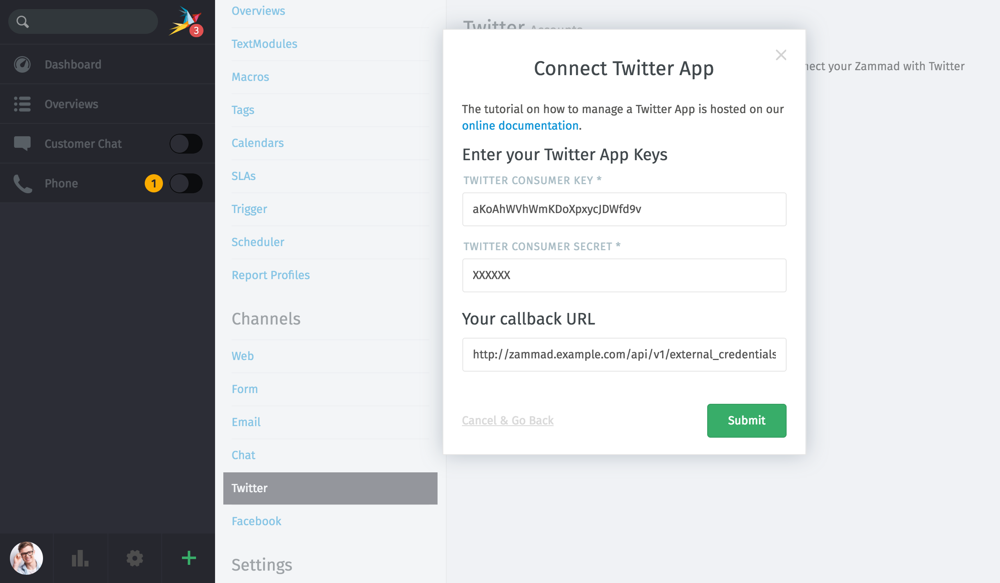
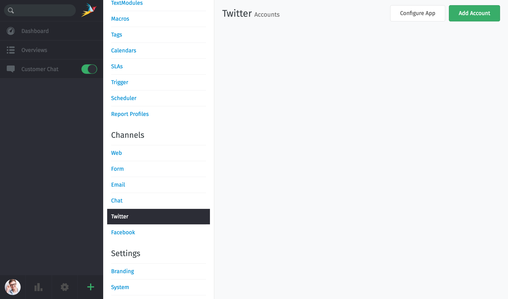
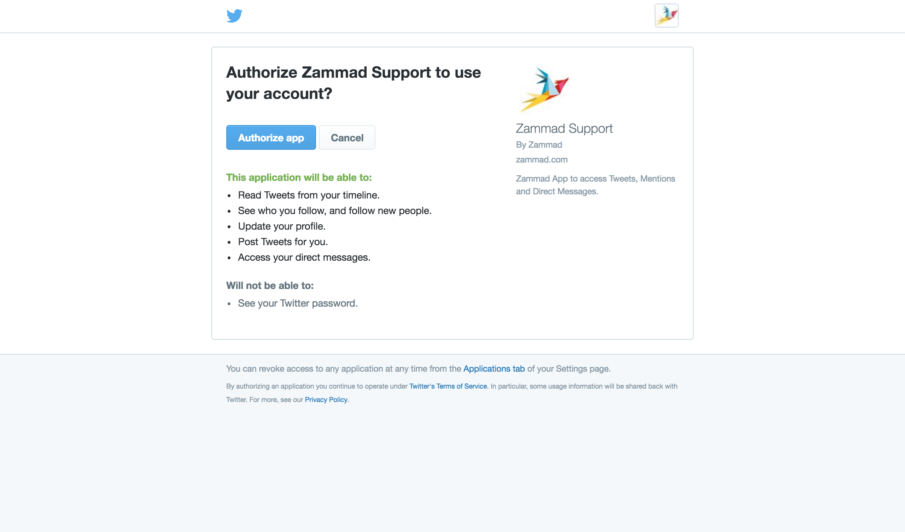
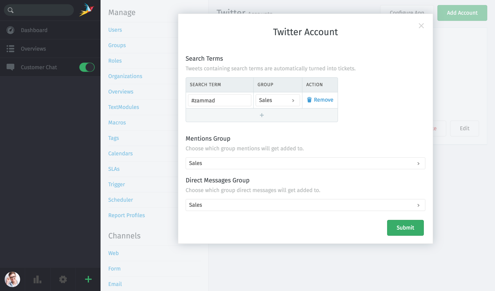
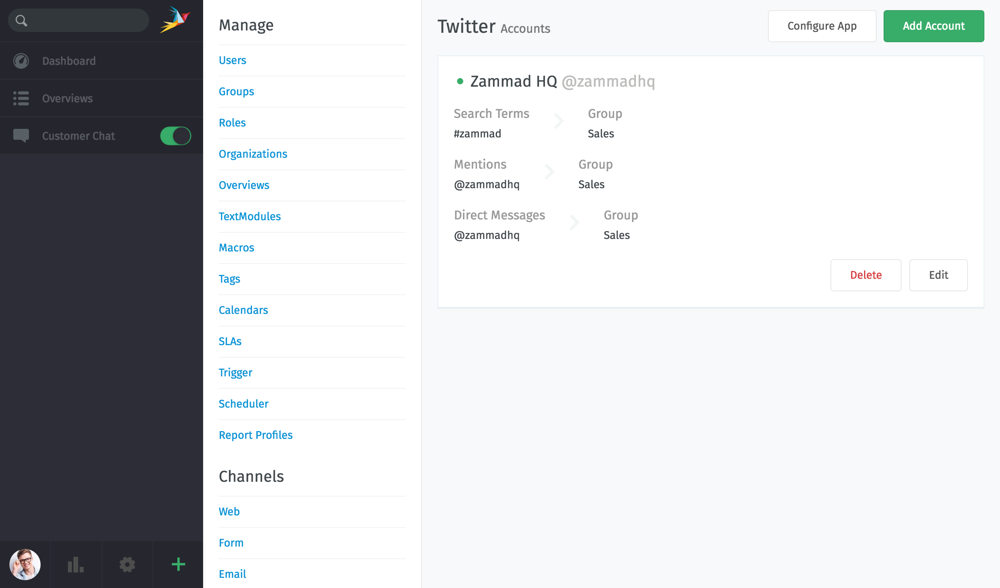
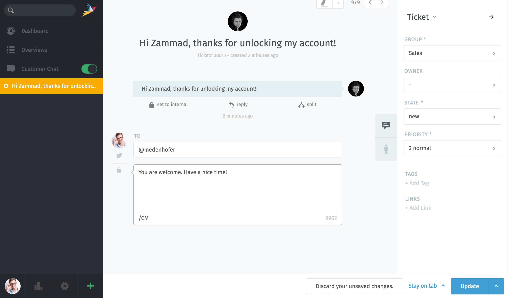
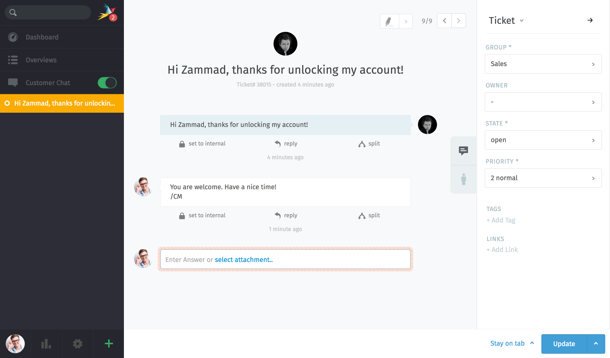

Twitter
*******

It's possible to put your Twitter communication into Zammad. To do so, you need to follow these steps:

Register Twitter app
====================

Register your Zammad as Twitter app under http://apps.twitter.com. It's required to let Zammad read/write tweets.

.. image:: images/apps.twitter.com_start.png
   :alt: inital page

Click on "Create New App"

Enter app settings. As "Callback URL" you need to enter "https://zammad_host/api/v1/external_credentials/twitter/callback"

After the app has been created, update the application icon and organization attributes.

.. image:: images/apps.twitter.com_set_permissions.png
   :alt: set permissions to receive & send direct messages

Next we need to set _read, write and access direct messages permissions_ for the app.

.. image:: images/apps.twitter.com_get_credentials.png
   :alt: click on Keys & Access Token, note them

Go to "Keys and Access Token" tab and note the "Consumer Key" and "Consumer Secret".

Configure Zammad as Twitter app
===============================

Go to "Admin -> Channels -> Twitter"

Click on "Connect Twitter App" and enter your "Consumer Key", "Consumer Secret" and verify the "Callback URL".

Done, your Zammad is configured as Twitter App now.

Link your Twitter account to your Zammad Twitter app
====================================================

Now you need to link your Twitter Account from which you want to get tweets and send out tweets.

Click on "Add Account", then you will see the authorize app page of Twitter. Click on "authorize app".

You will get redirected back to Zammad. Now you need to configure your search keys, where mentions and direct messages should get routed.

After you are done, you will get an overview of all linked Twitter Accounts.

Start using your new channel
============================

Start and write a message (direct message or tweet), short time later you will have a new ticket in Zammad.

Just click on reply button (as you do it for emails) to send a reply.

