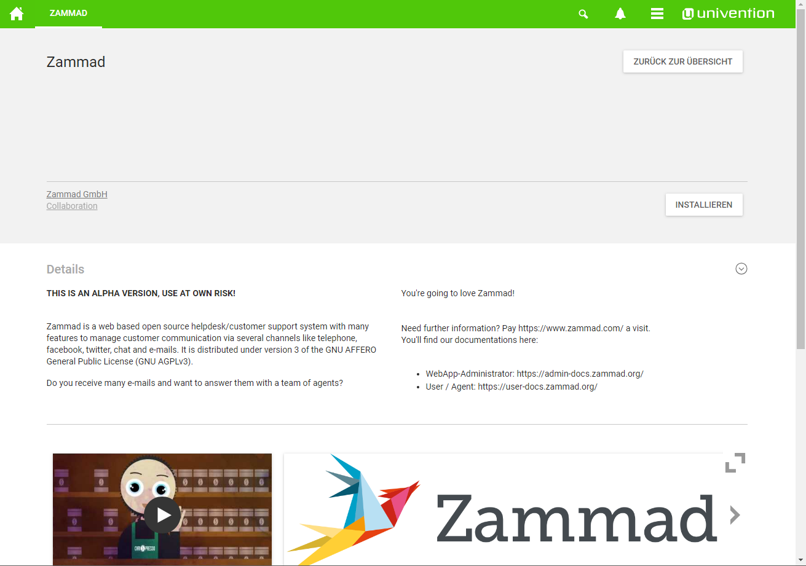

Install on Univention via App-Store
***********************************

.. Note:: As Zammad is using docker-compose for Univention, the minimum requirement is UCS 4.3.

Univention is a corporate server that unifies several small services into a big, powerful service collection.
As it can already bring LDAP and mail integrations, Zammad is the perfect add-on for this suite.

`Click here to learn more about Univention and what it can do for you. <https://www.univention.de/>`_.

Prerequisites
=============

To install the Zammad app within the Univention universe, please ensure that you're using at least UCS 4.3.
The basic installation will already meet our requirement. You'll need the following additional things:

* a E-Mail-Server (no matter if handled via UCS or with an external system)
  * you need this for notifications, as you can't use sendmail in our docker setup!
* you should at least have **2 CPU-Cores and 4GB of RAM**

.. Note:: Running the Zammad-App with less than 4GB free RAM, this will lead to unexpected errors!

You see, that's not much - so go a head with the installation.

Installing Zammad
=================

The app installation it self is quite easy: Just open the App Center within Univention and search for ``Zammad``.
Press ``Install``, read our license agreement and wait for the installation to finish.

The installation will take about 5-15 minutes, depending on your hardware speed.
If it's finished, you can press ``open`` - you'll get to our Zammad-Wizard. It helps you with the minimum of information we need. ( See ``First steps you should consider`` )
 
.. image:: images/univention/installed-zammad.png
 

Values we automatically change during the UCS-Setup
---------------------------------------------------

In order to make the installation as complete and convenient as possible, we're changing the following default values to the following:

.. csv-table:: Changes values during installation
	:header: "value", "default value", "new value"
	:widths: 10,20,20
	
	"notification sender", "Notification Master <noreply@#{config.fqdn}>", "Zammad <noreply@{FQDN-of-UCS}>"
	"maximum email size", "10 MB", "35 MB"
	"FQDN", "{FQDN-of-UCS}", "{FQDN-of-UCS}:10412"
	"HTTP-Type", "<empty>", "http"
	"Allow customer registration", "true", "false"
	"LDAP configuration", "<empty>", "Full LDAP-Configuration prepared ²"
	"LDAP activated", "<empty>", "false"

.. Note:: ² Please note that LDAP is pre filled with authentication data and group mapping ``Zammad-Admin`` to Admin-Role and ``Zammad-Agent`` to Agent-Role. You can use those security groups.
  LDAP-Sync is disabled during installation, as activating it would break the installation wizard of Zammad.

First steps you should consider
===============================

The most important part is obvious: Run the wizard and insert the information for your admin account.

.. Warning:: If the E-Mail-Address is used within UCS, you need to ensure that your user account within UCS has the needed Admin-Group, as other wise a LDAP-Synch will downgrade your account!

You can now enter your company name and upload a company logo, if you want to. (the company name is mandatory).
The system URL has been set by our installation routine already, you should be good to continue without changing it.

.. Note:: Changing the system URL might lead to broken links within notification mails.

For the notification sender, you should use SMTP, as the docker container does not come with any sendmail or local MTA.
If you choose local MTA, Zammad will not be able to send you any notifications.

The last step offers you to add your first E-Mail-Accounts to Zammad.
You're free to skip this step, you can configure your accounts later as well.

Zammad is now ready to go.
If you want to take advantage of Univentions LDAP-Server, you need to do the following before hand:

* Add your desired Admin-Users to the security group ``Zammad-Admin`` 
* Add your desired agents to the security group ``Zammad-Agent`` 
* All user accounts that are not covered by the default group mapping, will be added as customer

You can now go to Admin-Settings -> Integration => LDAP and simply activate LDAP. 
The first LDAP-Sync will start shortly after - Zammad will then sync your LDAP data hourly.

.. Note:: You're free to change the group-role mapping at any time. See `Configuring LDAP integration <https://admin-docs.zammad.org/en/latest/integrations/ldap.html>`_ for more information.

.. image:: images/univention/initial-setup-ucs.gif

Further configuration
---------------------

The rest of the configuration is pretty straight forward and applies to our default.
We split our documentation into two further parts that will be of your interest:

 * `Admin-Documentation <https://admin-docs.zammad.org/>`_ this documentation holds any information about how to configure Zammad via WebApp 
 * `User-Documentation <https://user-docs.zammad.org/>`_ this documentation holds a complete user documentation (how to work with Zammad)

Issues you might encounter
==========================

Below we have gathered information to problems that might occur in combination with Univention.

Zammad can't communicate with external systems
----------------------------------------------

In rare cases (sometimes even right after installation), Zammad won't be able to communicate with e.g. external 
E-Mail-Servers. Simply restarting the Zammad-App within Univention Portal should be enough to get it back to working.
