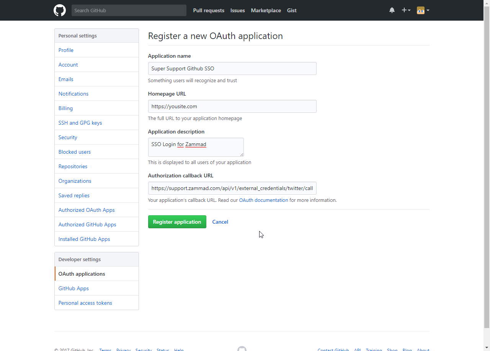
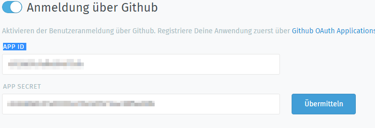

Github
******

It is possible to create a quick login for your helpdesk via Twitter To do so, you need to follow these steps:

Register Github App
===================

Visit https://github.com/settings/applications/new and enter the app settings as callback URL you need to enter "https://zammad_host/api/v1/external_credentials/twitter/callback"

   
   
Configure Zammad as Github app
==============================

Enter the "APP ID" and the "APP SECRET" from the Github OAUTH Applications Dashboard

   
NOTICE: Don't forget to enable the function
======

