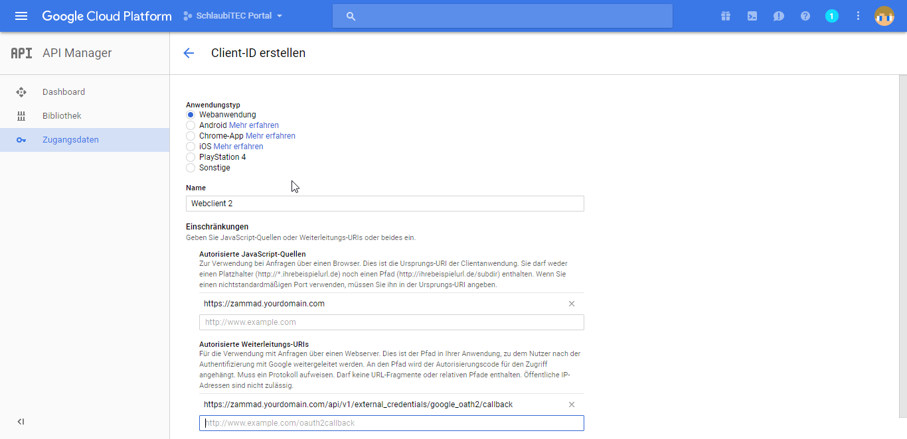

Google
******

Register Google app
====================
Visit https://console.cloud.google.com/projectcreate and create an project

Create an OAUTH Client ID

   
Configure Zammad as Google app
==============================
   
Navigate to "Admind -> Security -> Third Party Applications" and enter the OAUTH Keys

.. image:: images/zammad_connect_google_thirdparty1.png
   :alt: Zammad
   
   
Notice: Don't forget to enabe the function
======

